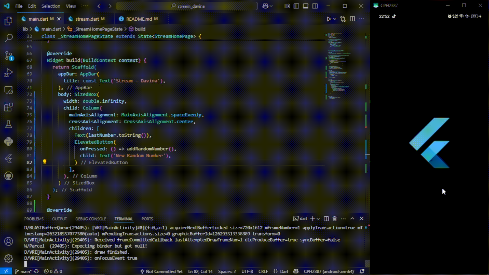
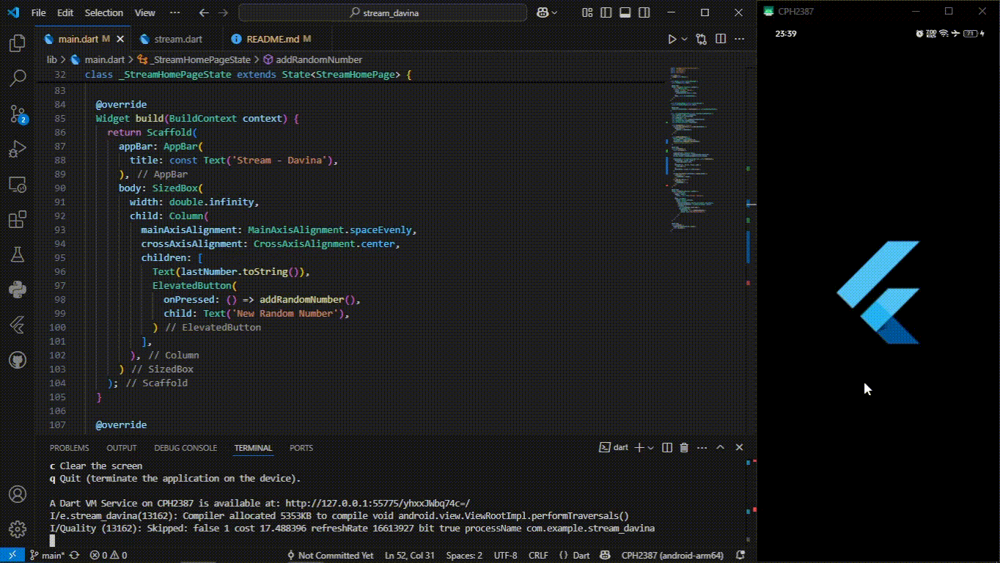
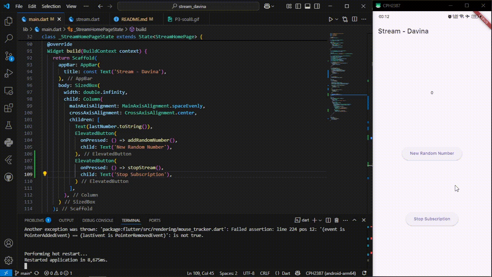

# Flutter - State Management dengan Streams

## Praktikum 1: Dart Streams
**Soal 1**
- Tambahkan nama panggilan Anda pada title app sebagai identitas hasil pekerjaan Anda.
- Gantilah warna tema aplikasi sesuai kesukaan Anda.
- Lakukan commit hasil jawaban Soal 1 dengan pesan "P1: Jawaban Soal 1" 

  

**Soal 2**
- Tambahkan 5 warna lainnya sesuai keinginan Anda pada variabel colors tersebut.
- Lakukan commit hasil jawaban Soal 2 dengan pesan "P1: Jawaban Soal 2"

  

**Soal 3**
- Jelaskan fungsi keyword yield* pada kode tersebut!
> Keyword `yield*` digunakan untuk mengalirkan semua elemen dari stream lain ke stream saat ini secara langsung.
- Apa maksud isi perintah kode tersebut?
> Dalam kode tersebut, `yield*` mengalirkan data dari `Stream.periodic(...)`, yaitu stream yang mengeluarkan warna dari daftar `colors` setiap 1 detik secara berulang. Jadi, fungsi `getColors()` akan mengeluarkan warna berbeda tiap detik sesuai urutan dalam list `colors`.
- Lakukan commit hasil jawaban Soal 3 dengan pesan "P1: Jawaban Soal 3"

  

**Soal 4**
- Capture hasil praktikum Anda berupa GIF dan lampirkan di README.
- Lakukan commit hasil jawaban Soal 4 dengan pesan "P1: Jawaban Soal 4"

  

**Soal 5**
- Jelaskan perbedaan menggunakan listen dan await for (langkah 9)!
> `.listen()` digunakan untuk berlangganan stream secara terus-menerus dan bisa dihentikan/di-pause dengan kontrol `StreamSubscription`. Sementara `await for` digunakan untuk menunggu data stream satu per satu secara async, tapi tidak bisa dihentikan sementara atau di-pause secara manual.
- Lakukan commit hasil jawaban Soal 5 dengan pesan "P1: Jawaban Soal 5"

## Praktikum 2: Stream controllers dan sinks
**Soal 6**
- Jelaskan maksud kode langkah 8 dan 10 tersebut!
> Langkah 8: Menginisialisasi stream dan mendengarkan datanya. Saat data baru masuk, `lastNumber` diperbarui dan UI di-refresh.
> Langkah 10: Fungsi `addRandomNumber()` membuat angka acak 0–9, lalu mengirimkan angka tersebut ke stream lewat `addNumberToSink()`, sehingga listener pada langkah 8 akan menerima dan memprosesnya.
- Capture hasil praktikum Anda berupa GIF dan lampirkan di README.
- Lalu lakukan commit dengan pesan "P2: Jawaban Soal 6"

  

**Soal 7**
- Jelaskan maksud kode langkah 13 sampai 15 tersebut!
> Langkah 13: Fungsi addError() menambahkan error ke stream melalui sink, agar listener bisa mendeteksi dan menangani error tersebut.
> Langkah 15: Memanggil addError() saat tombol ditekan, sehingga bukan angka acak yang dikirim, tapi error yang dipicu ke stream.
- Kembalikan kode seperti semula pada Langkah 15, comment addError() agar Anda dapat melanjutkan ke praktikum 3 berikutnya.
- Lalu lakukan commit dengan pesan "P2: Jawaban Soal 7"

## Praktikum 3: Injeksi data ke streams
- Jelaskan maksud kode langkah 1-3 tersebut!
> Langkah 1: Mendeklarasikan variabel `transformer` bertipe `StreamTransformer`, tapi belum langsung diinisialisasi (`late`).
> Langkah 2: Mengisi `transformer` dengan logika untuk memproses data stream: mengalikan nilai dengan 10, mengganti error jadi -1, dan menutup stream saat selesai.
> Langkah 3: Menerapkan `transformer` ke stream dan mendengarkan hasilnya; jika ada data, tampilkan nilainya, jika error, tampilkan -1.
- Capture hasil praktikum Anda berupa GIF dan lampirkan di README.
- Lalu lakukan commit dengan pesan "P3: Jawaban Soal 8"

  

## Praktikum 4: Subscribe ke stream events
- Jelaskan maksud kode langkah 2, 6 dan 8 tersebut!
> Langkah 2: Saat inisialisasi, aplikasi mulai mendengarkan data dari stream, dan setiap data baru akan ditampilkan di UI.
> Langkah 6: Langganan stream dihentikan agar tidak menerima data lagi, biasanya dilakukan saat widget dibuang (`dispose`).
> Langkah 8: Menghasilkan angka acak dan mengirimkannya ke stream, kecuali jika stream sudah ditutup, maka akan menampilkan nilai `-1` sebagai tanda error.
- Capture hasil praktikum Anda berupa GIF dan lampirkan di README.
- Lalu lakukan commit dengan pesan "P4: Jawaban Soal 9"

  