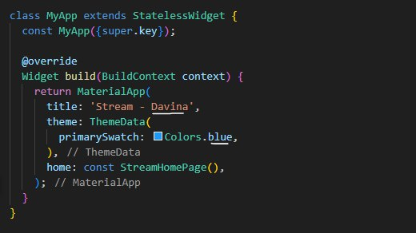
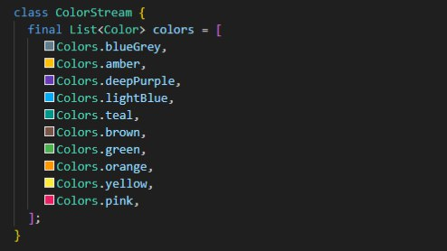
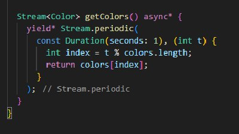
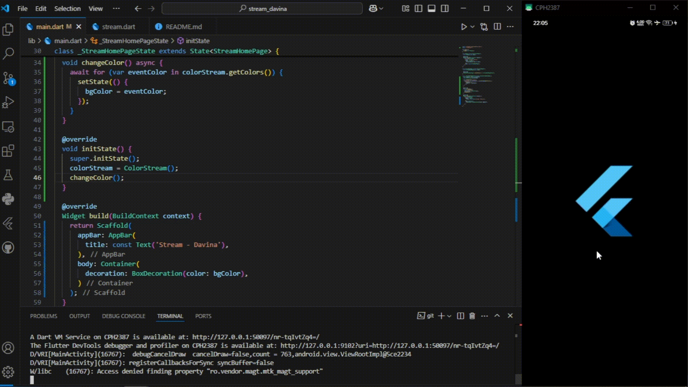

# Flutter - State Management dengan Streams

## Praktikum 1: Dart Streams
**Soal 1**
- Tambahkan nama panggilan Anda pada title app sebagai identitas hasil pekerjaan Anda.
- Gantilah warna tema aplikasi sesuai kesukaan Anda.
- Lakukan commit hasil jawaban Soal 1 dengan pesan "P1: Jawaban Soal 1" 

  

**Soal 2**
- Tambahkan 5 warna lainnya sesuai keinginan Anda pada variabel colors tersebut.
- Lakukan commit hasil jawaban Soal 2 dengan pesan "P1: Jawaban Soal 2"

  

**Soal 3**
- Jelaskan fungsi keyword yield* pada kode tersebut!
> Keyword `yield*` digunakan untuk mengalirkan semua elemen dari stream lain ke stream saat ini secara langsung.
- Apa maksud isi perintah kode tersebut?
> Dalam kode tersebut, `yield*` mengalirkan data dari `Stream.periodic(...)`, yaitu stream yang mengeluarkan warna dari daftar `colors` setiap 1 detik secara berulang. Jadi, fungsi `getColors()` akan mengeluarkan warna berbeda tiap detik sesuai urutan dalam list `colors`.
- Lakukan commit hasil jawaban Soal 3 dengan pesan "P1: Jawaban Soal 3"

  

**Soal 4**
- Capture hasil praktikum Anda berupa GIF dan lampirkan di README.
- Lakukan commit hasil jawaban Soal 4 dengan pesan "P1: Jawaban Soal 4"

  

**Soal 5**
- Jelaskan perbedaan menggunakan listen dan await for (langkah 9)!
> `.listen()` digunakan untuk berlangganan stream secara terus-menerus dan bisa dihentikan/di-pause dengan kontrol `StreamSubscription`. Sementara `await for` digunakan untuk menunggu data stream satu per satu secara async, tapi tidak bisa dihentikan sementara atau di-pause secara manual.
- Lakukan commit hasil jawaban Soal 5 dengan pesan "P1: Jawaban Soal 5"